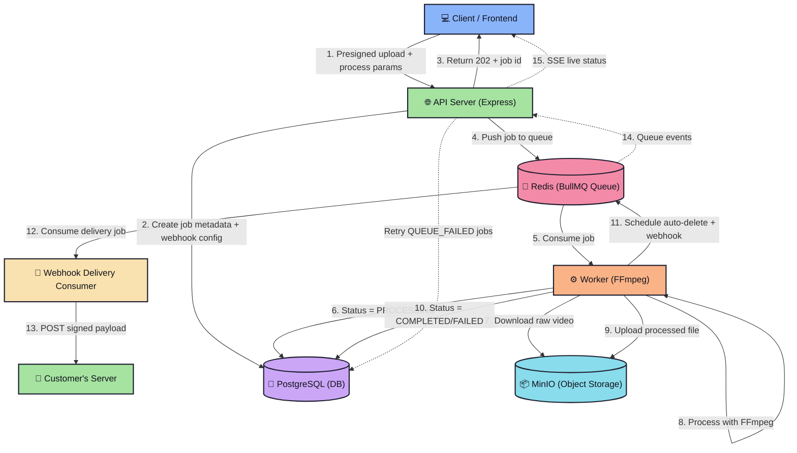

# Asynchronous Video Processing Pipeline


This project is a scalable, asynchronous video processing service built with a decoupled microservice architecture. It is designed to handle time-consuming, CPU-intensive tasks (like compression, trimming, and watermarking) without blocking the main API, ensuring a responsive user experience and a resilient backend. Clients get **live progress updates via SSE**, and can be **notified when processing finishes via signed webhooks**.

## ✨ Key Features

*   **⚡ High-Performance Processing**: The worker service utilizes **multi-threading** to maximize CPU usage for faster video compression and transcoding.
*   **🎬 7 Video Operations**: Extract audio, resize, compress, trim to a time range, create thumbnails, convert to **animated GIF**, and overlay **watermarks** (position/opacity/scale configurable).
*   **🌐 Web-Optimized Output**: Processed videos are automatically optimized for web playback (`moov` atom at the beginning), ensuring instant streaming start.
*   **🔴 Live Status via SSE**: The frontend streams real-time job progress over **Server-Sent Events** instead of polling, with an automatic fallback on connection loss.
*   **🔔 Webhooks**: Optionally receive an **HMAC-SHA256 signed** HTTP notification when a job completes or permanently fails — with retries, idempotency keys, and an SSRF guard.
*   **🖼️ HD Thumbnails**: Generates high-quality **720p thumbnails** for all uploaded videos.
*   **🗑️ Smart Auto-Cleanup**: To ensure privacy and optimize storage, original + processed videos are **automatically deleted** from S3 15 minutes after processing completes.
*   **🔄 Self-Healing Architecture**: Job parameters are persisted so a dedicated scheduler can re-queue jobs stuck after a transient queue failure — no request is lost.

## 🏗️ Architectural Overview

This system uses a decoupled microservice pattern where services communicate via a persistent job queue. The API (handles requests) is completely separate from the `worker` (performs heavy FFmpeg processing). The worker also runs a second consumer that delivers signed webhook notifications, and the API server relays BullMQ queue events to browsers over SSE.



**The processing flow is as follows:**
1.  **Client** uploads the raw video to **MinIO** via a presigned URL, then calls the **API Server** with the file's bucket/key and processing parameters (optionally `webhookUrl`/`webhookSecret`).
2.  The **API Server** validates the request (including a webhook SSRF guard), creates a job record in **PostgreSQL**, and stores the job type + parameters for self-healing.
3.  The **API Server** adds the job to the **Redis (BullMQ)** queue.
    * **On Success:** The job status is set to `UPLOADED` (queued). The client receives a `202 Accepted` with the job id.
    * **On Failure:** The status is set to `QUEUE_FAILED`, and a background scheduler re-attempts the enqueue every 5 minutes using the persisted job metadata.
4.  **Worker** consumes the job, updates the status to `PROCESSING`, downloads the file from MinIO, and runs the required **FFmpeg** command (reporting progress back to the queue).
5.  Upon completion, the **Worker** uploads the processed file to MinIO, updates the status to `COMPLETED`, schedules auto-deletion in 15 minutes, and enqueues a webhook delivery (if configured).
6.  The **API Server** subscribes to queue events and pushes **live progress to the browser over SSE**.
7.  If the job permanently fails, the **Worker** updates the status to `FAILED` and a failure webhook is delivered.

## 📡 Webhooks

Provide a `webhookUrl` (and optionally `webhookSecret`) when creating any job to be notified when it finishes:

```bash
curl -X POST http://localhost:3000/api/v1/videos/compress \
  -H "Content-Type: application/json" \
  -d '{
    "clientId": 123,
    "bucket": "videos",
    "key": "1736000000-clip.mp4",
    "fileName": "clip.mp4",
    "webhookUrl": "https://your-app.com/webhooks/video",
    "webhookSecret": "shared-secret"
  }'
```

**Delivered payload:**

```json
{
  "event": "video.completed",
  "data": {
    "videoId": 42,
    "status": "COMPLETED",
    "downloadUrl": "https://.../presigned-download-url"
  }
}
```

**Reliability guarantees:**
*   **Signing** — the raw body is signed with `HMAC-SHA256` using your secret and sent as the `X-Webhook-Signature` header (verify to confirm authenticity). Secret is optional (unsigned mode).
*   **Idempotency** — each event has a unique `X-Event-ID`; retries reuse it so consumers can safely dedupe.
*   **Retries** — up to 5 attempts with exponential backoff (30s → 8m); non-2xx responses and timeouts (10s) count as failures.
*   **Delivery log** — every attempt is recorded in the `webhook_deliveries` table (status, HTTP code, error, attempt count).
*   **SSRF guard** — webhook URLs pointing at private/reserved networks (localhost, `10.x`, `192.168.x`, `169.254.169.254`, etc.) are rejected at submission time.

## 🔴 Live Status (SSE)

Replace polling with a persistent, server-pushed stream:

```
GET /api/v1/videos/{videoId}/stream   →   text/event-stream
```

The stream immediately emits a `snapshot` of the current state, then `progress` events while processing, and a terminal `completed` / `failed` event with the download URL when the job finishes. A heartbeat keeps the connection alive, and the `EventSource` client reconnects automatically. The frontend falls back to a one-shot status request if the stream fails repeatedly.

## 🛠️ Technology Stack

| Component | Technology | Purpose |
| :--- | :--- | :--- |
| **Services** | Node.js (TypeScript) | The runtime for the API and worker. |
| **API Framework** | Express | Handles all incoming HTTP requests, validation, and job creation. |
| **Frontend** | React + Vite | Upload UI with live SSE progress and per-operation settings. |
| **Processing** | FFmpeg | All video/audio manipulation (compress, resize, trim, GIF, watermark, ...). |
| **Queue** | BullMQ | Persistent job queue built on Redis (video processing + webhook delivery). |
| **Broker** | Redis | Backend for BullMQ, storing pending, active, and failed jobs. |
| **Database** | PostgreSQL | Single source of truth for job metadata, status, and webhook delivery logs. |
| **File Storage** | MinIO | S3-compatible object storage for large video files. |
| **Monitoring** | Prometheus + Grafana | Metrics scraping, dashboards, and alerting for every service. |
| **Logging** | pino | Structured JSON logs with correlation IDs across API → worker. |
| **Queue UI** | Bull Board | Real-time queue inspector (`/admin/queues`). |
| **Containerization**| Docker & Docker Compose | Isolated, reproducible environment for all services. |

## 📊 Monitoring & Observability

The stack ships with full observability: metrics, alerts, structured logging, and a queue inspector.

| Tool | URL | Purpose |
| :--- | :--- | :--- |
| Prometheus | http://localhost:9090 | Scrapes `/metrics` from the API + worker, plus Redis/Postgres/MinIO exporters. |
| Grafana | http://localhost:3001 | Pre-provisioned "Video Processing Pipeline" dashboard + Prometheus datasource. |
| Alertmanager | http://localhost:9093 | Receives alerts from Prometheus rules (add a Slack/email receiver to enable). |
| Bull Board | http://localhost:3000/admin/queues | Live view of queue depth, job states, and retries. |

**What's measured**

*   **API server** (`/metrics`): HTTP request rate, 5xx rate, p50/p95/p99 latency, jobs enqueued, Node heap/RSS.
*   **Worker** (`worker:9100/metrics`): jobs started/completed/failed by operation, job duration percentiles, queue depth (`video_queue_depth`), webhook delivery outcomes.
*   **Infrastructure**: Redis (clients, memory), Postgres, MinIO — via `redis-exporter`, `postgres-exporter`, and MinIO's native `/minio/v2/metrics/cluster`.

**Alert rules** (`prometheus/alerts.yml`): service down (API/worker/Redis/Postgres), queue backlog > 20, elevated job failure rate, and API 5xx rate > 5%. Alerts fire to Alertmanager — wire a real receiver to get notified.

**Logging & correlation IDs**

Both services log structured JSON via **pino** with redaction of secrets. Every API request gets a correlation ID (pino-http `req.id`) that is forwarded into the BullMQ job data, so you can trace one request end-to-end:

```bash
# correlate an API request to its worker job
docker logs api-server | grep <correlation-id>
docker logs worker | grep <correlation-id>
```

**Health endpoints:** `GET /health` on the API (`:3000`) and worker (`:9100`) report DB, Redis, and MinIO status (200/503).

**Optional env vars** (`.env`):

```bash
LOG_LEVEL=info              # pino log level
METRICS_PORT=9100           # worker metrics/health port
BULL_BOARD_USER=admin       # basic auth for /admin/queues (skip = no auth)
BULL_BOARD_PASSWORD=admin
GRAFANA_ADMIN_USER=admin    # Grafana login
GRAFANA_ADMIN_PASSWORD=admin
``` |

## 📦 Service Breakdown

This project consists of the following services defined in `docker-compose.yml`:

1.  **`frontend`**: The user interface for interacting with the application.
2.  **`api-server`**: The public-facing HTTP service — accepts uploads, creates jobs, validates webhook URLs, hosts the self-healing scheduler (cron), and streams live status over SSE.
3.  **`worker`**: A background service that consumes jobs from the queue, runs FFmpeg, schedules auto-deletion, and runs the webhook delivery consumer.
4.  **`db`**: The PostgreSQL database.
5.  **`minio`**: The S3-compatible object store.
6.  **`redis`**: The message broker for the queues.
7.  **`prometheus` / `grafana` / `alertmanager`**: Metrics collection, dashboards, and alerting.
8.  **`redis-exporter` / `postgres-exporter`**: Export Redis/Postgres metrics to Prometheus. MinIO exposes its own Prometheus endpoint.

## 🔌 API Endpoints

All routes are under `/api/v1` and documented with **Swagger** at `/api-docs`.

| Method | Endpoint | Description |
| :--- | :--- | :--- |
| `POST` | `/videos/presigned-url` | Get a presigned URL for uploading a file. |
| `POST` | `/videos/extract-audio` | Extract the audio track from a video. |
| `POST` | `/videos/resize` | Resize a video to target width/height. |
| `POST` | `/videos/compress` | Compress a video (CRF + preset). |
| `POST` | `/videos/create-thumbnail` | Generate a thumbnail at a timestamp. |
| `POST` | `/videos/trim` | Cut a video to a time range (startTime/endTime). |
| `POST` | `/videos/create-gif` | Convert a video to an animated GIF (fps/width). |
| `POST` | `/videos/add-watermark` | Overlay an image onto a video (position/opacity/width). |
| `GET` | `/videos` | List all videos. |
| `GET` | `/videos/{videoId}` | Get status + download URL for a video. |
| `GET` | `/videos/{videoId}/stream` | Live SSE status stream. |

Any `POST` endpoint accepts an optional `webhookUrl` and `webhookSecret` field. All write endpoints share a strict rate limit (50 / 15 min); read endpoints allow sustained polling (600 / 15 min).

## 🚀 Deployment

### Local Development
1.  **Clone the Repository**
    ```bash
    git clone https://github.com/Sangyog10/Video-Editor.git
    cd Video-Editor
    ```
2.  **Start Services**
    ```bash
    docker-compose up --build
    ```
3.  **Run Migrations**
    ```bash
    docker exec -it api-server npm run migrate
    ```

### Production (VPS)
For a complete guide on setting up this application on a VPS (Ubuntu/DigitalOcean/Azure) with Nginx, SSL, and Domain configuration, please refer to the **[VPS Setup Guide](./VPS_SETUP.md)**.

## 📝 License
This project is licensed under the ISC License.
