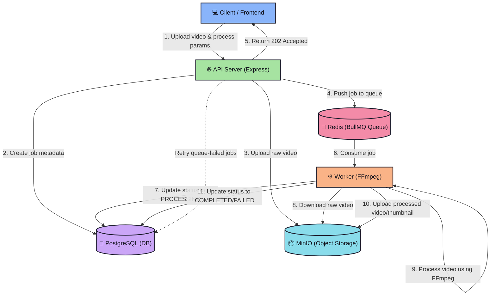

# Asynchronous Video Processing Pipeline


This project is a scalable, asynchronous video processing service built with a decoupled microservice architecture. It is designed to handle time-consuming, CPU-intensive tasks (like audio extraction and video resizing) without blocking the main API, ensuring a responsive user experience and a resilient backend.

## ✨ Key Features

*   **⚡ High-Performance Processing**: The worker service utilizes **multi-threading** to maximize CPU usage for faster video compression and transcoding.
*   **🌐 Web-Optimized Output**: Processed videos are automatically optimized for web playback (`moov` atom at the beginning), ensuring instant streaming start.
*   **🖼️ HD Thumbnails**: Generates high-quality **720p thumbnails** for all uploaded videos.
*   **🗑️ Smart Auto-Cleanup**: To ensure privacy and optimize storage, videos are **automatically deleted** from S3 15 minutes after the download link is generated.
*   **🔄 Self-Healing Architecture**: A dedicated scheduler monitors for stalled jobs and recovers them, ensuring no request is lost.

## 🏗️ Architectural Overview

This system uses a decoupled microservice pattern where services communicate via a persistent job queue. This design ensures that the API (which handles user requests) is completely separate from the `worker` (which performs heavy processing).



**The processing flow is as follows:**
1.  **Client** sends a `multipart/form-data` request (video file, job parameters) to the **API Server**.
2.  The **API Server** validates the request, uploads the raw video to **MinIO**, and creates a job record in **PostgreSQL** with a `PENDING_QUEUE` status.
3.  The **API Server** then attempts to add the `jobId` to the **Redis (BullMQ)** queue.
    * **On Success:** The job status in PostgreSQL is updated to `QUEUED`. The client receives a `202Accepted` response.
    * **On Failure:** The status remains `PENDING_QUEUE`. The client receives an error, and the system is left in a safe state.
4.  **Worker** service, which is constantly listening to the queue, picks up the job.
5.  **Worker** updates the job status to `PROCESSING`, downloads the file from MinIO, and executes the required **FFmpeg** command.
6.  Upon completion, the **Worker** uploads the *new* processed file to MinIO and updates the job status in PostgreSQL to `COMPLETED` or `FAILED`.
7.  A background **Scheduler** (running as a cron task inside the API Server) runs periodically, looking for jobs stuck in the `PENDING_QUEUE` state (due to a transient queue failure) and re-attempts to add them to the queue, making the system self-healing.

## 🛠️ Technology Stack

| Component | Technology | Purpose |
| :--- | :--- | :--- |
| **Services** | Node.js (TypeScript) | The runtime for both the API and worker. |
| **API Framework** | Express | Handles all incoming HTTP requests, validation, and job creation. |
| **Processing** | FFmpeg | A robust C library for all video/audio manipulation. |
| **Queue** | BullMQ | A fast, persistent job queue library built on Redis. |
| **Broker** | Redis | The backend for BullMQ, storing all pending, active, and failed jobs. |
| **Database** | PostgreSQL | The single source of truth for all job metadata and status. |
| **File Storage** | MinIO | S3-compatible object storage for large video files. |
| **Containerization**| Docker & Docker Compose | For building, running, and networking all services in an isolated, reproducible environment. |

## 📦 Service Breakdown

This project consists of 6 core services defined in `docker-compose.yml`:

1.  **`frontend`**: The user interface for interacting with the application.
2.  **`api-server`**: The public-facing HTTP service that accepts uploads, creates jobs, and hosts a built-in self-healing scheduler (cron).
3.  **`worker`**: A background service that consumes jobs from the queue and runs FFmpeg.
4.  **`db`**: The PostgreSQL database.
5.  **`minio`**: The S3-compatible object store.
6.  **`redis`**: The message broker for the queue.

## 🚀 Deployment

### Local Development
1.  **Clone the Repository**
    ```bash
    git clone https://github.com/Sangyog10/Video-Editor.git
    cd Video-Editor
    ```
2.  **Start Services**
    ```bash
    docker-compose up --build
    ```
3.  **Run Migrations**
    ```bash
    docker exec -it api-server npm run migrate
    ```

### Production (VPS)
For a complete guide on setting up this application on a VPS (Ubuntu/DigitalOcean/Azure) with Nginx, SSL, and Domain configuration, please refer to the **[VPS Setup Guide](./VPS_SETUP.md)**.

## 📝 License
This project is licensed under the ISC License.